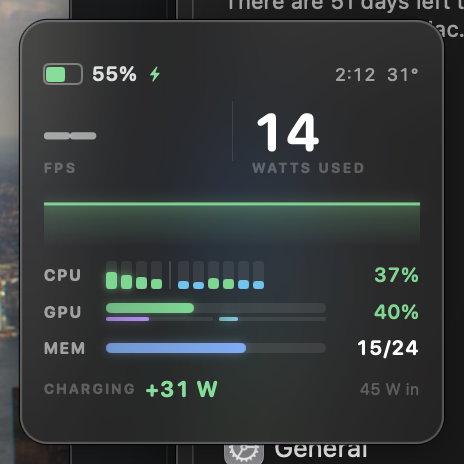

# DeskStats

A small always-on desktop widget for Apple Silicon Macs. Per-core CPU load, GPU
utilisation, memory, power draw and charging rate — in a 212×212 card that looks
like it came with the OS.



## What it shows

| | |
|---|---|
| **FPS** | Display presentation rate — tracks a fullscreen game's output (see caveat) |
| **Watts used** | System draw, derived from adapter input minus what the battery absorbs |
| **CPU** | One bar per core, performance cores separated from efficiency cores |
| **GPU** | Device utilisation, with renderer and tiler broken out beneath |
| **MEM** | Active + wired + compressed, the way Activity Monitor counts it |
| **Power** | Charging or draining rate, negotiated adapter wattage, and the PD ceiling |

Multi-port aware: it reads the full `AppleRawAdapterDetails` array, so if more
than one source is connected it reports which one macOS selected and how many
are present.

## Install

```sh
./install.sh
```

Builds the app, copies it to `~/Applications`, and registers a LaunchAgent so it
starts at login. `./build.sh` alone just produces `build/DeskStats.app`.

## Controls

| Action | Result |
|---|---|
| Drag | Move it anywhere |
| Double-click | Slide off the nearer edge, leaving 10% visible; again to restore |
| Right-click | Placement, launch-at-login, quit |
| ⌃⌥⌘D | Cycle placement — the way back out of click-through mode |

Three placements: **On Desktop** (pinned to the wallpaper, under every window),
**Float Above Windows** (default), and **Game Overlay** — above the shielding
window level so it composites over fullscreen apps, with clicks passing through
to the game underneath.

## Behaviour

Designed to be invisible when it is not wanted:

- **Holds no power assertions.** Never prevents sleep, display sleep or hibernate.
- **Suspends entirely on sleep** and on display sleep; resumes on wake.
- **Sudden termination enabled**, so logout and restart are never delayed.
- **`ProcessType: Background`** — the scheduler throttles it freely.
- Survives reboots via the LaunchAgent; `KeepAlive` restarts it on crash but
  respects a deliberate Quit.
- Repositions itself if the display it lived on is unplugged.

Costs roughly 0.5–1% CPU and ~50 MB at a 1 Hz sample rate.

## Two honest limits

**Per-GPU-core load does not exist on Apple Silicon.** macOS publishes only three
aggregate counters — `Device`, `Renderer` and `Tiler Utilization %`. The widget
shows all three rather than inventing per-core bars. `gpu-core-count` and
`core_mask_list` in the IORegistry are static topology, not live load.

**FPS is a presentation rate, not an in-process frame counter.** There is no
public API to read another application's frame rate; overlays like RTSS and
MangoHud inject into the graphics API, which requires disabling SIP. DeskStats
instead counts display presentation events via `CGDisplayStream`, which tracks a
fullscreen game's output and is bounded by the display's refresh rate. It needs
**Screen Recording** permission (System Settings → Privacy & Security → Screen
Recording); without it the FPS field reads `––`. For authoritative in-game
numbers, Apple's Metal HUD (`MTL_HUD_ENABLED=1`) is the right tool.

Per-core *temperature* is likewise unavailable — the SMC keys are not readable by
unprivileged processes on Apple Silicon. The temperature shown is the battery
sensor.

## Build

Requires only the Xcode Command Line Tools; there is no Xcode project.

```
Sources/Metrics.swift     IOKit + mach sampling
Sources/FPS.swift         CGDisplayStream frame counter
Sources/WidgetView.swift  SwiftUI presentation
Sources/main.swift        NSWindow shell, placement, lifecycle
```
